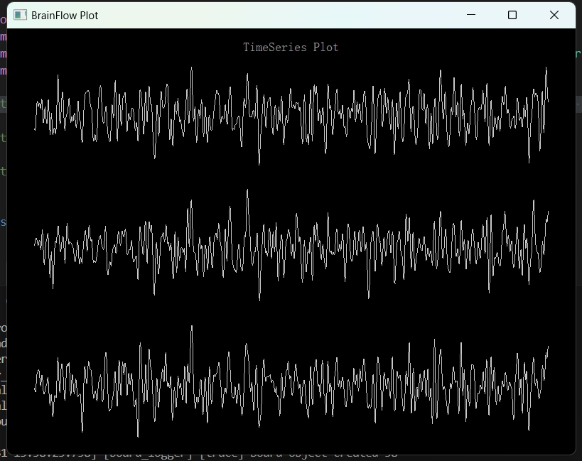

BrainFlow
================

`BrainFlow website <https://brainflow.org/>`_

`BrainFlow github <https://github.com/brainflow-dev/brainflow/>`_

BrainFlow is a library intended to obtain, parse and analyze EEG, EMG, ECG and other kinds of data from biosensors.

Key Features
~~~~~~~~~~~~~~
- **9 Language Bindings ( Python, Matlab, C# and etc )**
- **5 OS / Platforms ( Windows, Mac, Linux, Android, Devices )**
- **Signal Processing and ML API**

Getting Started
~~~~~~~~~~~~~~~~~~~~~~~~~~~~~~
Requirements: Windows10+(64bit) PC with Bluetooth 4.0+ and Python3.7+(64bit)

Install BrainFlow python_package.

.. code-block:: bash

    pip install https://github.com/SynchroniSI/brainflow/releases/download/v0.0.1/brainflow-0.0.1-py3-none-any.whl

Install requirements for python code sample:

.. code-block:: bash

    pip install -r https://github.com/SynchroniSI/brainflow/releases/download/v0.0.1/requirements.txt

Run example code: Download `plot_real_time_min.py <https://github.com/SynchroniSI/brainflow/releases/download/v0.0.1/plot_real_time_min.py>`_

.. code-block:: bash

    python plot_real_time_min.py --board-id=58 --mac-address=C4:64:E3:D8:E6:C6

param **--board-id** list:

- **Sync-Uno** [board-id=57]
- **Sync-Trio** [board-id=58]
- **Sync-Octo** [board-id=59]
- **Sync-Neo** [board-id=60]

param **--mac-address**: :ref:`GET_MAC_ADDRESS`

