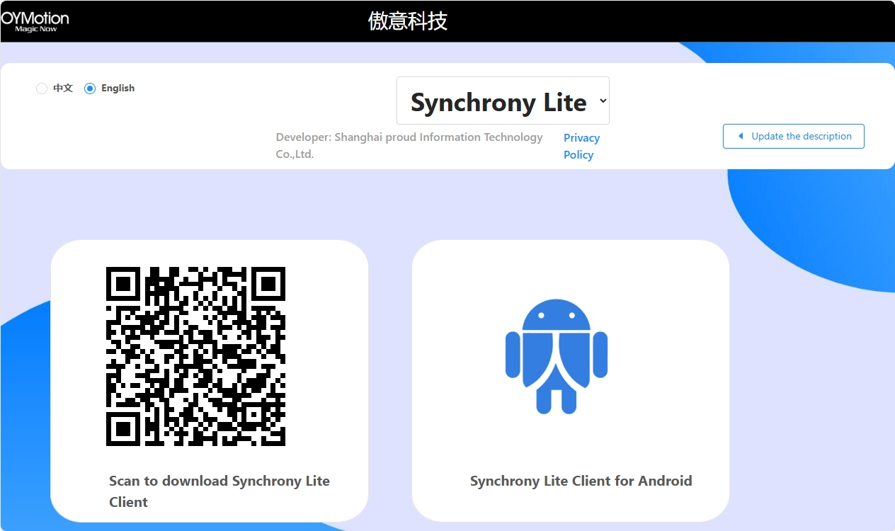

FAQ
=================

.. _GET_MAC_ADDRESS:
How to get MAC address of Synchroni device?
--------------------------------------------------

Choose Synchrony **LITE** app from droplist `Download <https://synchrony.oymotion.com/admin/index>`_.

|
|

Open app and scan devices to check **MAC address** (For example **F8:8A:5E:BF:76:AA**) of your device.

.. image:: ./_static/Scan.jpg
    :width: 400
    :align: center

|
|

How to increase EEG collection quality?
--------------------------------------------------
-  Decrease impedance as much as possible.
-  Please keep away from strong electromagnetic interference sources.
-  Make sure that nobody pass by during the EEG collection process.
-  Please try best to reduce blinking and vigorous head movements.

.. _DECREASE_IMPEDANCE:
How to decrease impedance?
--------------------------------------------------
-  Ensure that the electrodes are in close contact with the skin.
-  If skin is dry, please spray a little bit of water at the contact points between the electrodes and the skin.