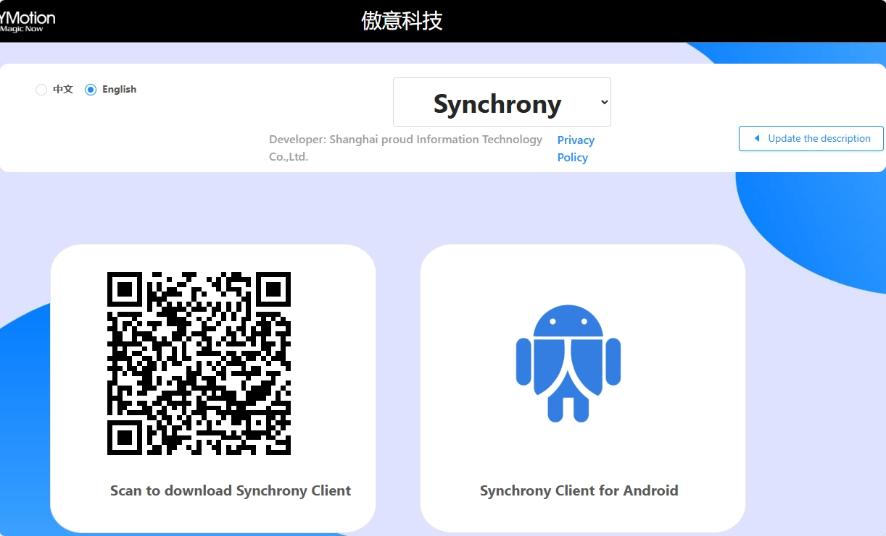
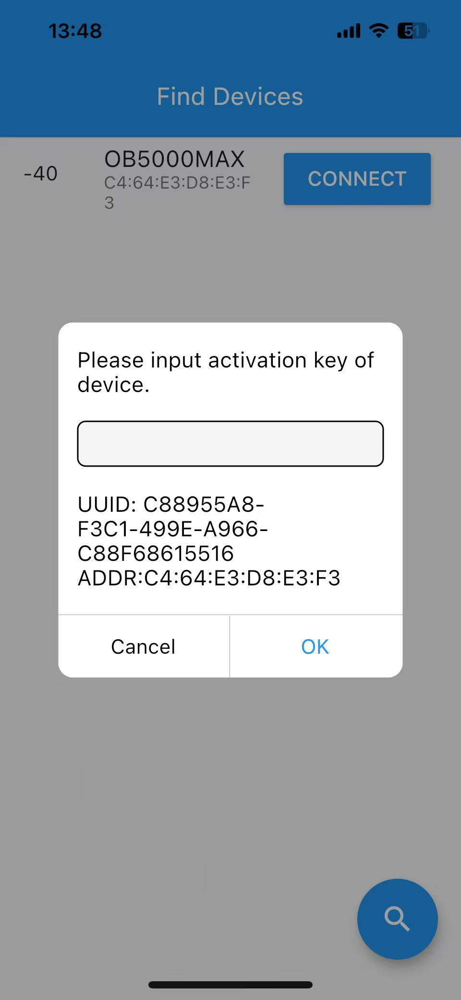
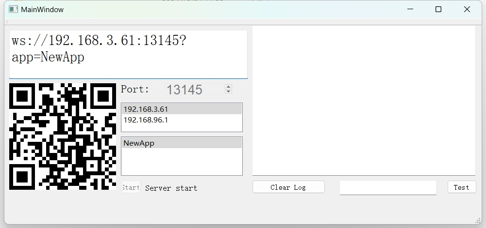
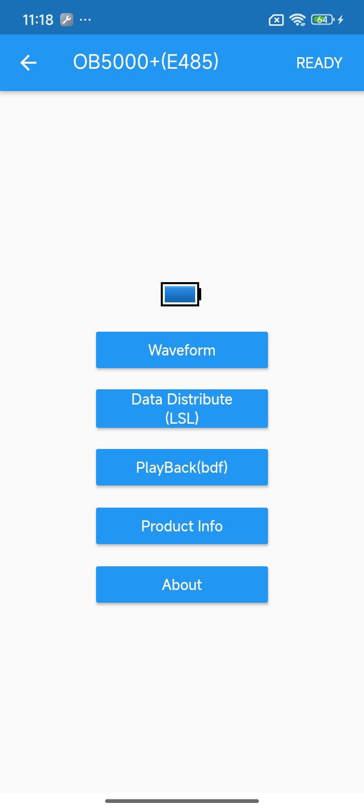
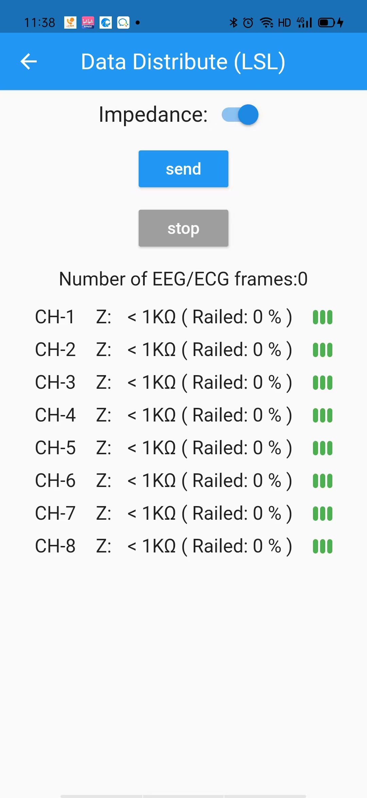
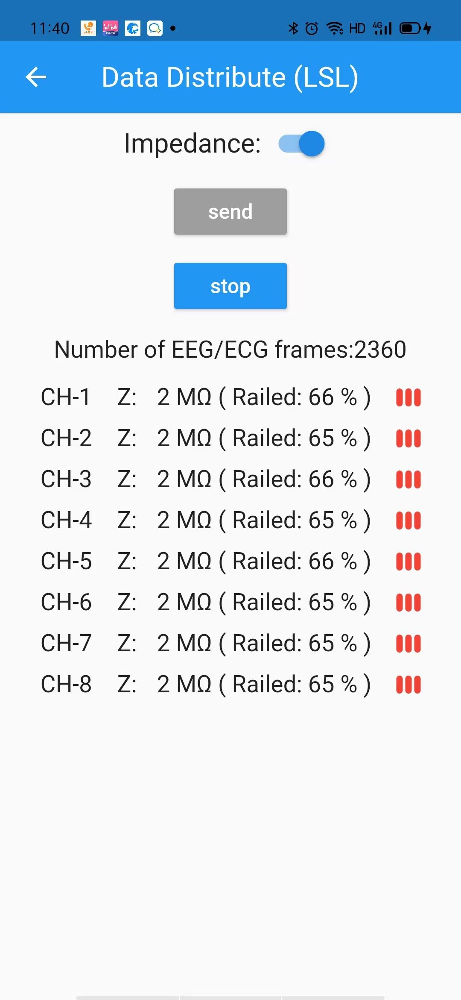
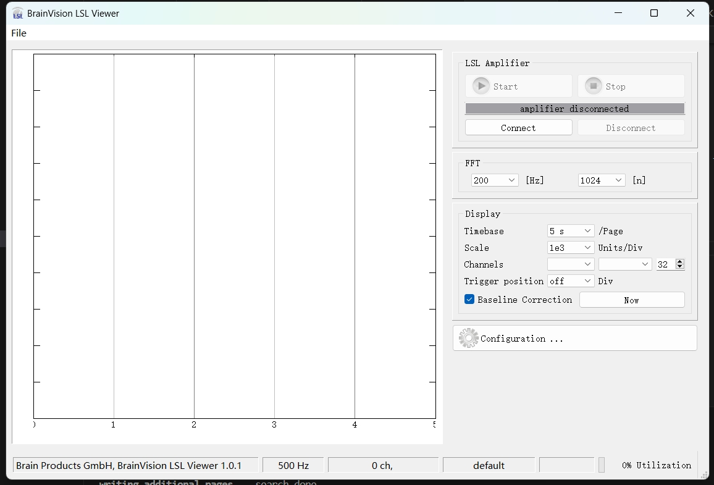
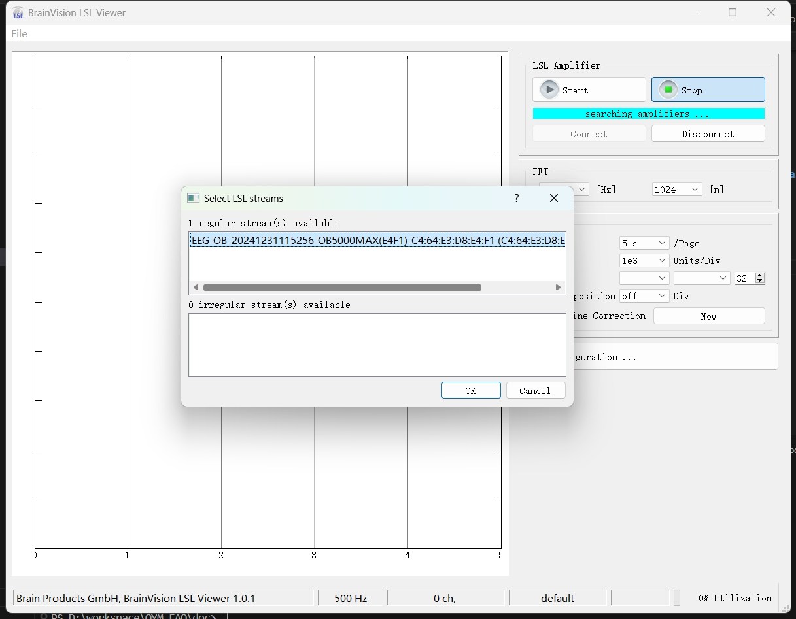
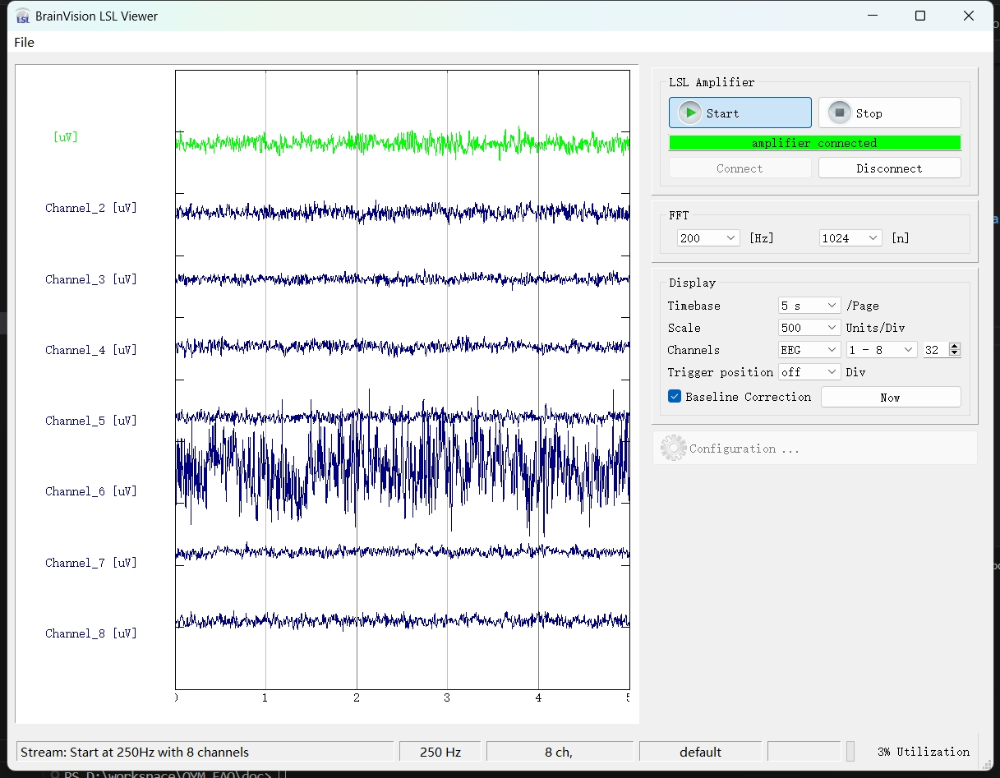

LSL
================

`LabStreamingLayer documentation <https://labstreaminglayer.readthedocs.io/>`_

`LabStreamingLayer github <https://github.com/sccn/labstreaminglayer>`_

The lab streaming layer (LSL) is a system for the unified collection of measurement time series in research experiments that handles both the networking, time-synchronization, (near-) real-time access as well as optionally the centralized collection, viewing and disk recording of the data.

Key Features
~~~~~~~~~~~~~~
- **6 Language Bindings ( Python, Matlab, C# and etc )**
- **4 OS ( Windows, Mac, Linux, Android )**
- **Rich 3rd Party Tools**

Tools
~~~~~~~~~~~~~~

- `OYM_BCI_TOOLS <https://rehab.oymotion.com/OYM_BCI_TOOLS1.0.16.zip>`_
- `LSLViewer <https://www.brainproducts.com/download/brainvision-lsl-viewer>`_
- `PyQtRealTimeViewer <https://github.com/labstreaminglayer/App-SigVisualizer>`_
- `Recorder <https://github.com/labstreaminglayer/App-LabRecorder>`_
- `Playback <https://github.com/cbrnr/sigviewer>`_
- `Matlab <https://github.com/labstreaminglayer/App-MATLABViewer>`_
- `Unity <https://github.com/labstreaminglayer/LSL4Unity>`_
- `MNE <https://mne.tools/mne-lsl/stable/index.html>`_
- `Python <https://github.com/labstreaminglayer/pylsl>`_

Getting Started
~~~~~~~~~~~~~~~~~~~~~~~~~~~~~~
Requirements: Windows10+(64bit) PC, an iPhone or Android device, download

- `OYM_BCI_TOOLS <https://rehab.oymotion.com/OYM_BCI_TOOLS1.0.16.zip>`_ 
- `LSLViewer <https://www.brainproducts.com/download/brainvision-lsl-viewer>`_
- `Synchrony app <https://synchrony.oymotion.com/admin/index>`_

|
|

Open app and connect device.

.. image:: ./_static/Scan.jpg
    :width: 400
    :align: center

|
|

Please ask sales person for activation key.

|
|

Start OYM_BCI_Tools.exe, please allow network access in firewall.

If there is more than one IP address, please select the IP address in the **same network** as iPhone or Android device.

|
|

Make sure iPhone or Android device is connected to the **same network** as OYM_BCI_Tools.

Select Data Distribute(LSL), scan QRCode in OYM_BCI_Tools.

|
|

Press **send** button.

|
|

For best results, please decrease impledance of electrodes.(For example: **Z** value better less than 100k, **Railed** value better less than 30% )

:ref:`DECREASE_IMPEDANCE`

|
|

Start **BrainVision LSL Viewer**, click **Connect** button.

    
|
|

Select **LSL stream**.

|
|

`Check how to deal with LSL stream <https://bci.plus/data-processing-with-lsl-bv/>`_

